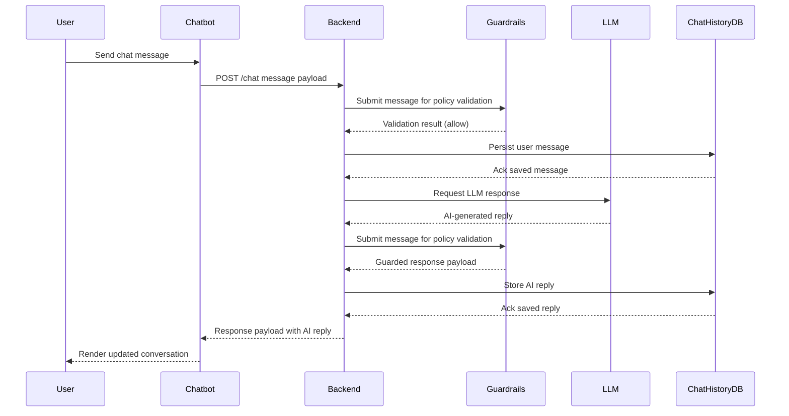

# System Diagrams

## Chat Flow Sequence Diagram


## Logon Flow Sequence Diagram


## Overall Data Flow Diagram (DFD)
```mermaid
flowchart LR
    subgraph Client Layer
        U[User Browser]
    end

    subgraph Presentation Layer
        W[Web Application]
    end

    subgraph Application Layer
        B[Backend API]
        G[Guardrails Middleware]
        M[AI Model Service]
        A[Authentication Service]
    end

    subgraph Data Layer
        D[(ChatHistoryDB)]
        L[(Logs/Analytics)]
    end

    U -- HTTP Requests --> W
    W -- API Calls --> B
    W -- Auth Requests --> A
    B -- Policy Checks --> G
    G -- Prompt Orchestration --> M
    M -- Responses --> G
    G -- Validated Replies --> B
    B -- Read/Write --> D
    A -- Credential Checks --> D
    B -- Event Streams --> L
    W -- UX Metrics --> L
    U <-- Rendered UI -- W
    W <-- Auth Tokens -- A
    B <-- Stored Responses -- D
```
