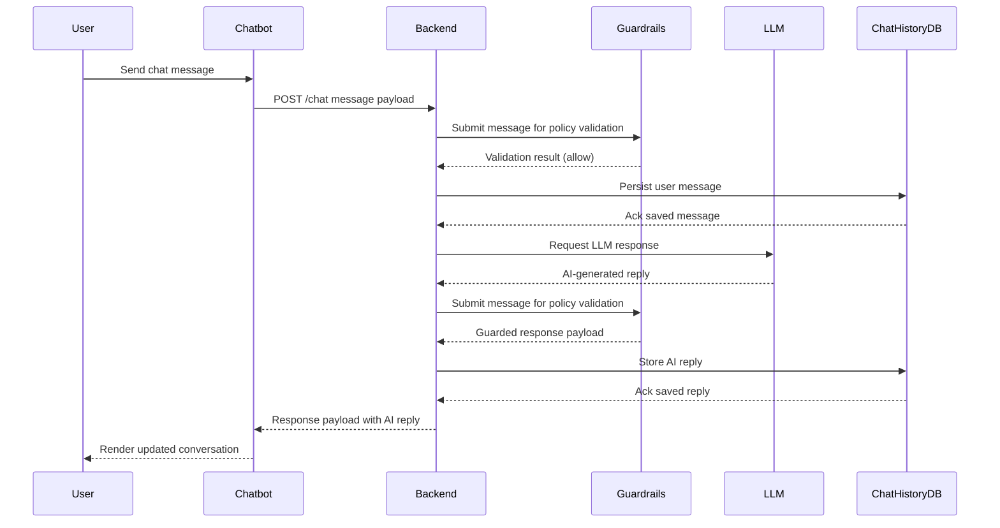
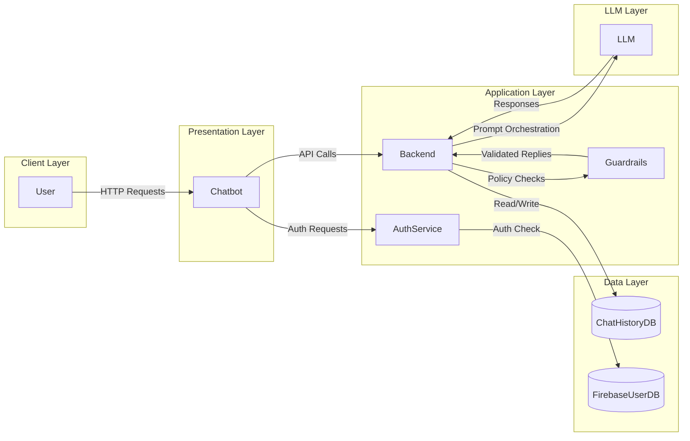

# System Diagrams

## Chat Flow Sequence Diagram

```mermaid
sequenceDiagram
    participant User
    participant Chatbot
    participant Backend
    participant Guardrails
    participant LLM
    participant ChatHistoryDB

    User->>Chatbot: Send chat message
    Chatbot->>Backend: POST /chat message payload
    Backend->>Guardrails: Submit message for policy validation
    Guardrails-->>Backend: Validation result (allow)
    Backend->>ChatHistoryDB: Persist user message
    ChatHistoryDB-->>Backend: Ack saved message
    Backend->>LLM: Request LLM response
    LLM-->>Backend: AI-generated reply
    Backend->>Guardrails: Submit message for policy validation
    Guardrails-->>Backend: Guarded response payload
    Backend->>ChatHistoryDB: Store AI reply
    ChatHistoryDB-->>Backend: Ack saved reply
    Backend-->>Chatbot: Response payload with AI reply
    Chatbot-->>User: Render updated conversation
```

## Logon Flow Sequence Diagram

```mermaid
sequenceDiagram
    participant User
    participant Chatbot
    participant AuthService
    participant ChatHistoryDB

    User->>Chatbot: Submit credentials
    Chatbot->>AuthService: POST /login (credentials)
    AuthService->>ChatHistoryDB: Validate user record
    ChatHistoryDB-->>AuthService: User record & password hash
    AuthService->>AuthService: Verify password & generate token
    AuthService-->>Chatbot: Auth token & session info
    Chatbot-->>User: Set session & redirect to dashboard
```

## Overall Data Flow Diagram (DFD)

```mermaid
flowchart LR
    subgraph Client Layer
        U[User]
    end

    subgraph Presentation Layer
        C[Chatbot]
    end

    subgraph Data Layer
        D[(ChatHistoryDB)]
        F[(FirebaseUserDB)]
    end

    subgraph Application Layer
        B[Backend]
        G[Guardrails]
        A[AuthService]
    end


    subgraph LLM Layer
        L[LLM]
    end


    U -- HTTP Requests --> C
    C -- API Calls --> B
    C -- Auth Requests --> A
    A -- Auth Check --> F
    B -- Policy Checks --> G
    G -- Validated Replies --> B
    B -- Prompt Orchestration --> L
    L -- Responses --> B
    B -- Read/Write --> D
```
